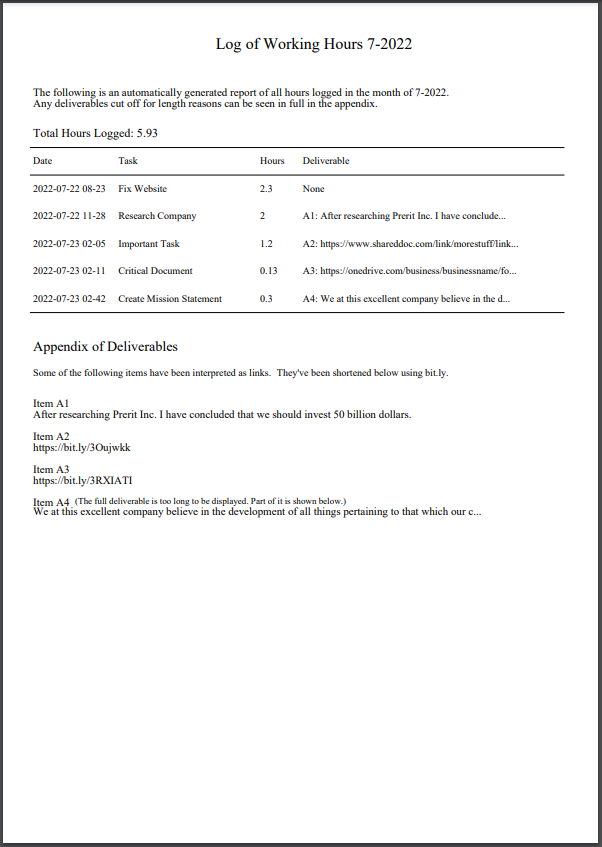

# Working Hours CLI

An extremely simple-to-use command-line interface built to remove the stress of logging working hours, keeping track of completed payable tasks, and referencing deliverables. Simply `clockin` to your task, complete it, and `clockout`, and the rest is taken care of. Of course, that's just the bare-bones functionality... A heap of features await you.


See the CLI in action... (Note: this demonstration has not yet been updated to reflect new formatting and PDF report features, including `export` and `previewmonth`. See the [export section](#export) below to learn about PDF reports.)

[](https://asciinema.org/a/pBSbTGPRHUhbKkkGw85DqMeSq)

## Deployment

I deployed the CLI above using a script called `loghours`...

```bash
#!/bin/bash

python3.10 "/home/path/to/Working Hours CLI/main.py" "$@"
```

I then added the script's directory to $PATH, and gave it executable permissions with `chmod +x loghours`. This allows me to call it like a professional CLI application from anywhere in the system, with the `loghours` command. All arguments passed to `loghours`, such as `loghours clockin "this or that" --hours 2`, are passed individually to the Python script thanks to the script above.


## Usage and Behavior

The CLI interacts with a Deta database whose credentials are supplied by a project key provided in `_keys.py` (see [`_keys (sample).py`](_keys%20(sample).py)), in the same directory as `main.py`. 

Whenever a new item is added to the database, using `clockin`, the item is assigned a completely unique random string `key`. If you try to run a command (ex. `deliverable "a task"` to view the deliverable of task "a task," and there are multiple tasks named "a task," the CLI will print all items (including their keys) and prompt you to rerun the command but append `--key KEY`, where KEY is the key printed beside the name of an item. 

In the specific circumstance that you're clocking out of a task whose name is shared by other tasks, if only one occurrence of all the tasks with that name is _unfinished_, you'll automatically be clocked out of that unfinished task, without the need for manually providing a `key` as explained above. 


## Commands

The following is a list of all commands with their behavior summarized.

| Command | Behavior| 
| --- | --- |
| clockin | Create a new task and clock in. |
| clockout | Clock out of an unfinished task. |
| deliver | Stores a deliverable item after you've clocked out. |
| deliverable | View a tasks's deliverable. |
| export | Create a PDF report of the provided month's work log. |
| log | Displays a full log of all work hours. |
| pickup | Continue working on a pre-existing task. |
| previewmonth | Displays all tasks of a given month. |
| removetask | Removes task with `key`. |
| totalhours | Calculates the total hours worked on all tasks. |

### clockin

Create a new task and clock in.

If you provide `hours`, the task will be marked as completed with `hours` hours. The date will be set to `hours` hours before the current moment, as if you forgot to clock in then and are doing so after the fact.

If you provide `date`, you will override the date calculations and forcibly insert `date`. The only reason to do this is if you're working on a task currently and forgot to clock in when you started. You can clock in, pass in the properly formatted date representing the time you started, and then clock out whenever you're finished.

If you set `titlecase` as `False`, it becomes harder to reference the task in future commands. For example, if you create a task with the name "hEllo" and try to execute `deliver "hello" "deliverable"`, you'll get an error. If "hEllo" was instead automatically or manually set as "Hello", the previous command would work.

| Option | Type | Note |
| --- | --- | --- |
| --hours | float | Log a completed task that took this many hours. |
| --date | string | Force date. Use this is if you started but forgot to clock in. |
| --titlecase | bool | Override auto titlecasing. Makes future reference harder. |

### clockout 

Clock out of an unfinished task.

Does not work on finished tasks; i.e. tasks with a finite `Hours` value.

If you have multiple tasks of the same name, and only one of them is unfinished,  clocks out of the unfinished task.

Deliver a task directly while clocking out with --deliver. If you use --hours, the  `hours` value provided is used instead of a standard calculation involving the current time.

| Option | Type | Note |
| --- | --- | --- |
| --key | string | Unique database key, for use if prompted by CLI. |
| --hours | float | Force the number of hours worked. |
| --deliver | string | Add a deliverable item. |

### deliver 

Stores a deliverable item after you've clocked out.

Note that you don't technically have to clock out to add a deliverable. And, deliverables can also be added directly when clocking out. See `clockout --help` to learn more.

| Option | Type | Note |
| --- | --- | --- |
| --key | stirng | Unique database key, for use if prompted by CLI. |

### deliverable

View a task's deliverable.

| Option | Type | Note |
| --- | --- | --- |
| --key | string | Unique database key, for use if prompted by CLI. |

### export

Create a PDF report of the provided month's work log. This is useful for exporting a report of all work completed once the month is over. For example, it's August 1st and you'd like a report of all the work you completed in July to send to your employer. Execute `export 7-2022` and you will have a properly formatted PDF document to forward on. 

Exports the provided month's tasks in PDF and CSV formats. The file is automatically stored in your current directory; i.e. where your terminal/shell is navigated upon executing the command.

The required `monthyear` parameter takes the format "7-2022" where  7 is July and 2022 is the year.

A sample generated PDF is displayed below. 



In case you want all the raw data, a CSV file is automatically exported to the same directory as the PDF file (shell current working directory). This can be opened directly in Excel and either preserved or converted to .xlsx format. 

| Option | Type | Note |
| --- | --- | --- |
| monthyear | string | Month and year, ex. 7-2022 for July, 2022. |

### log

Displays a full log of all work hours.

### pickup 

Continue working on a pre-existing task.

Finds a _completed_ task from the database, resets its date to `hours` hours ago, and removes its `hours` value to indicate that it's unfinished. That way you can continue working and clock out as normal. The resulting behavior is that you add on the extra time between when you picked up the task and when you clock out again.

| Option | Type | Note |
| --- | --- | --- |
| --key | string | Unique database key, for use if prompted by CLI. || Option | Type | Note |

### previewmonth

Displays all tasks of a given month. This is useful when previewing the contents of an export before exporting to a PDF. See the section on `export` (or run `export --help`) to learn more about why you'd ever want to do that.

The required `monthyear` parameter takes the format "7-2022" where  7 is July and 2022 is the year.

| Option | Type | Note |
| --- | --- | --- |
| monthyear | string | Month and year, ex. 7-2022 for July, 2022. |

### removetasks

Removes task with `key`.

### totalhours

Calculates and displays the total hours worked on all tasks.