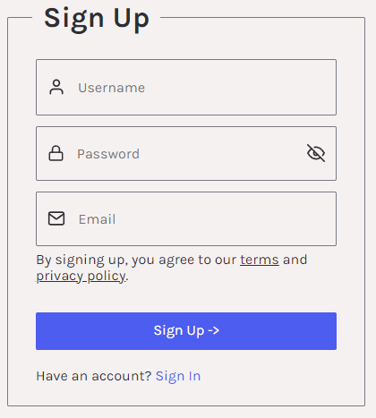
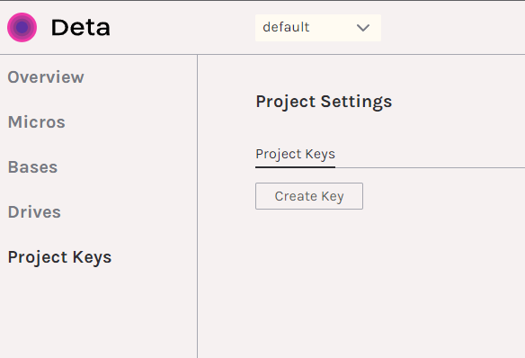

# Getting Started

```{note}

A basic understanding of Python and the console would be useful, as we'll be adding a script to PATH, installing Python, dealing with its aliases, and working with `pip`. 
```

Setting up the CLI takes just a few steps.


## Accounts

The only account you'll need is with [Deta](https://deta.sh). Deta is completely free, and signing up takes just a second. 



Once you have an account, you'll need to create a "project," or use the "default" pre-created project if you don't care to organize your Deta account for future use.

Navigate to the "project key" section of your project and create a new key.



Save it, as you'll need this key when we configure `keys.ini` later.


### Optional Accounts

A [Bitly](https://bitly.com) account is optional. If you include your Bitly API key in `keys.ini`, any deliverable links will be automatically shortened in exported PDF reports, so the full shortened link is on the page. Otherwise, the link will be cut off.

A RapidAPI key is optional. It connects to the [Capitalize My Title](https://capitalizemytitle.com) API to enable smart capitalization of your task names. This would turn "doing a very import task" into "Doing a Very Important Task," as opposed to "Doing A Very Important Task." If you don't provide a key, all task names are hard-capitalized (unless you provide the `--no-titlecase` flag, of course).


### Setup

That's all you need. The CLI handles the creation, management, and use of your Deta Bases (separated by month).

Start by cloning the repository somewhere safe.

```console
git clone https://github.com/preritdas/working-hours-cli.git
```

Then navigate into the repository and rename the `keys (sample).ini` file to `keys.ini`. Open it in `vim` or any text editor.

It should have the following contents.

```ini
[Deta]
project_key = 


[Bitly]
access_token = 


[RapidAPI]
api_key = 
```

Insert your Deta project key after the equals sign (=) under Deta. As mentioend, the other two are optional. If you have them, include them. Save and close the file. It should look something like the below.

```ini
[Deta]
project_key = 79asc7d6aprojectkey89df


[Bitly]
access_token = 98a7d87cbitlybitlysa98c


[RapidAPI]
api_key = ha98asdcg98asdcsupersecret9
```

Don't include quotes or backslashes for raw characters. The file is parsed raw, so whatever characters are outside the equals sign are considered part of the key.


## Requirements


You'll need to have Python 3.10 on your system. If you don't already, the easiest installation methods are below.

`````{tabs}

````{tab} macOS 

Use Homebrew.

```console
brew install python@3.10
```
````

````{tab} Windows

Download the executable installer from [python.org](https://python.org). Make sure you add Python to your PATH (an option in the installer), and take note of what the alias is (most likely `python`.)

Check if `pip` works.

```console
pip list
python -m pip list
python3.10 -m pip list
```
````

If none of these show you a list of packages, download [this file](https://bootstrap.pypa.io/get-pip.py) and run it with Python 3.10. 

````{tab} Linux

Use `apt` and the `deadsnakes/ppa` repository.

```console
sudo apt update && sudo apt -y upgrade && sudo apt autoremove -y
sudo add-apt-repository ppa:deadsnakes/ppa
sudo apt-get install -y python3.10
sudo apt-get install -y python3.10-pip
```

See if you have `pip` working with the following commands... 

```console
pip list
python -m pip list
python3 -m pip list
python3.10 -m pip list
```

If not, run the following script.

```console
curl https://bootstrap.pypa.io/get-pip.py | python
````

Make sure to replace `python` above with your correct Python 3.10 alias. It could also be `python3` or `python3.10`. 
```
`````
### Packages

Once you have Python installed, from within the repository folder you cloned earlier, run `pip install -r requirements.txt` (replacing `pip` with your `pip` alias, which could also be `pip3`, and if those don't work, extend from your Python alias, ex. `python -m pip install -r requirements.txt` replacing `python` with your Python alias).


### The script

Almost there. Everything is set up and good to go, but the only way to run the CLI is with `python path/to/repo/main.py` which is extremely ugly, especially given that your `pwd` will not be the repo folder when you're working.

So, take note of the _full_ sytem path to the repo and stick `main.py` at the end. For example, if your path to the repo (where you cloned it) is `Users/yourname/Documents/working-hours-cli`, the path you want is `Users/yourname/Documents/working-hours-cli/main.py`. This is the entry point we'll need for our script.

```bash
#/bin/bash

python3.10 "Users/yourname/Documents/working-hours-cli/main.py" "$@"
```

This script will work on Mac or Linux. Give it no extension, with the name of the alias you want to use for the CLI (I use `loghours`). So, save the file as `loghours` with no extension. It needs to be in a folder on your PATH, so either stick it in the `~/bin/` folder or create a folder and add it to PATH.

Now, you can use `loghours` to interface with the CLI, as you saw in the CLI Reference. 

```console

loghours log

loghours clockin "new task"
loghours clockout --deliver "All the work."
loghours clockin "started earlier" --hours 2 

loghours delivery "new task"
loghours pickup "new task"
loghours clockout

loghours previewmonth 8-2022
loghours export 8-2022

loghours totalhours --payrate 30
```
